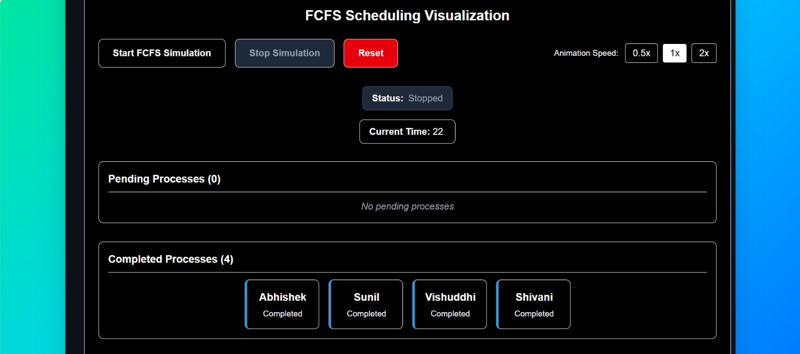

# 🏥 Hospital Patient Scheduling Simulator – A Visual & Real‑World Approach
Efficient patient scheduling is critical in hospitals and clinics to ensure timely medical care, reduced waiting time, and optimal utilization of doctors and consultation rooms.  
This project provides an **interactive visualization of patient scheduling strategies**, adapted from classical CPU scheduling algorithms, to demonstrate how different approaches affect patient waiting time and treatment order.

---

## 🎯 Why Patient Scheduling?

In a real-world hospital environment, patients arrive at different times, require varying consultation durations, and may have different urgency levels (triage). Choosing the right scheduling strategy helps:

- ⏳ **Reduce Patient Waiting Time** – Time spent waiting before consultation.
- ⌛ **Minimize Total Time in Clinic** – From patient arrival to completion of consultation.
- 🚑 **Prioritize Critical Patients** – Ensure urgent cases are treated first.
- ⚡ **Improve Doctor Utilization** – Avoid idle time and overload.

Optimized scheduling improves patient satisfaction, operational efficiency, and quality of healthcare delivery.

---

## 🏥 Real-World Mapping

| Scheduling Concept | Hospital Interpretation |
|-------------------|------------------------|
| Process           | Patient                |
| Arrival Time      | Patient Check-in Time  |
| Burst Time        | Consultation Time (mins) |
| Priority          | Triage Level (1 = Critical) |
| CPU               | Doctor / Consultation Room |
| Gantt Chart       | Patient Treatment Timeline |

---

## 📌 Implemented Scheduling Strategies

### 🏁 First Come First Serve (FCFS)
Patients are treated strictly in the order they arrive.  
Best suited for small clinics with low patient load.

### ⏱ Shortest Job First (SJF)
Patients with the **shortest consultation time** are treated first.  
Helps clear minor cases quickly and reduce average waiting time.

### 🔄 Round Robin (RR)
The doctor rotates between patients using a fixed time slice.  
Useful in emergency rooms where multiple patients require partial attention.

### 🎖 Priority Scheduling
Patients are treated based on **triage level**, not arrival time.  
Critical patients receive immediate attention, ensuring medical urgency is respected.

---

## 🧰 Tech Stack

- **Frontend:** HTML, CSS, JavaScript
- **Framework:** Vite
- **Visualization:** Custom Gantt Chart Rendering
- **Algorithms:** FCFS, SJF, Round Robin, Priority Scheduling
- **Version Control:** Git, GitHub

---
## 🎨 Visualizing Patient Scheduling
The simulator provides a **real-time visual treatment timeline** using a Gantt-chart-style representation, allowing users to:

- See which patient is being treated at any moment
- Observe idle times and overlaps
- Compare average waiting and turnaround times across strategies

This makes scheduling behavior **intuitive, visual, and easy to understand**.

---

## 📥 Example: FCFS Patient Scheduling

### 📝 Input Example
<p align="center">
  
</p>
---

### 🔍 Visualization Process
<p align="center">
  
</p>

---

### 📤 Output Metrics
<p align="center">
  
</p>

---

## ⚡ Installation & Execution

### 🛠 Setup Instructions

📌 Clone the repository:
```bash
git clone https://github.com/your-username/hospital-patient-scheduling-simulator.git
cd hospital-patient-scheduling-simulator
````

▶️ Install dependencies:

```bash
npm install
```

▶️ Run the application:

```bash
npm run dev
```

---

## 🧪 How to Use

1. Select a scheduling strategy from the dropdown menu.
2. Add patient details (arrival time, consultation time, triage level).
3. Start the simulation.
4. Observe the patient treatment timeline and performance metrics.
5. Compare strategies to understand their real-world impact.

---

## 🎓 Educational & Practical Value

* Bridges **DSA concepts** with **real-world healthcare applications**
* Ideal for:

  * Data Structures & OS labs
  * Mini projects
  * Viva and project demonstrations
* Demonstrates how algorithmic decisions influence real human outcomes

---

## 🌱 Future Enhancements

* Multiple doctors / consultation rooms
* Emergency-only fast track
* Patient statistics dashboard
* Real hospital dataset integration

---

## 👩‍⚕️ Conclusion

The **Hospital Patient Scheduling Simulator** transforms abstract scheduling algorithms into a meaningful healthcare application.
By visualizing patient flow and treatment order, it highlights how smart scheduling can **save time, resources, and lives**.

---
